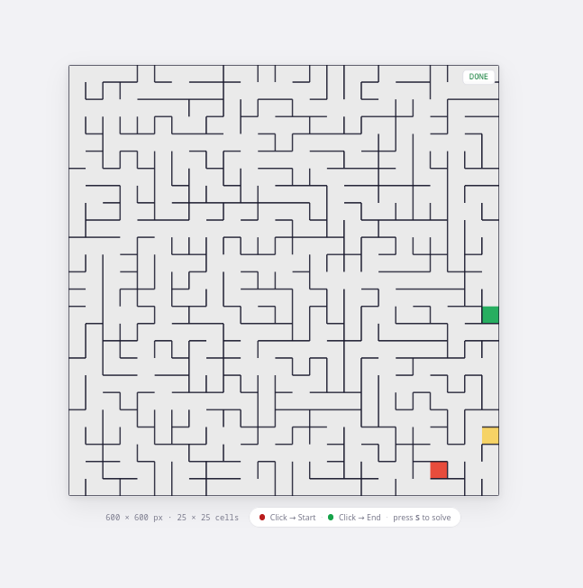
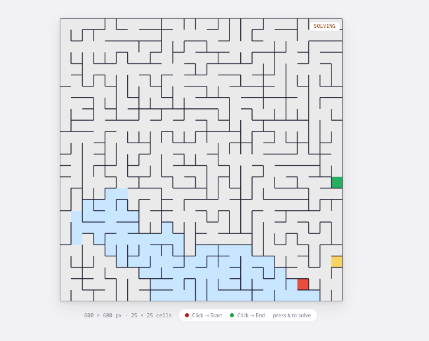
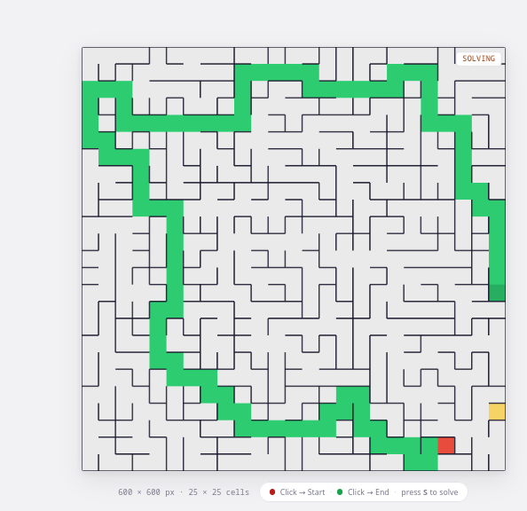
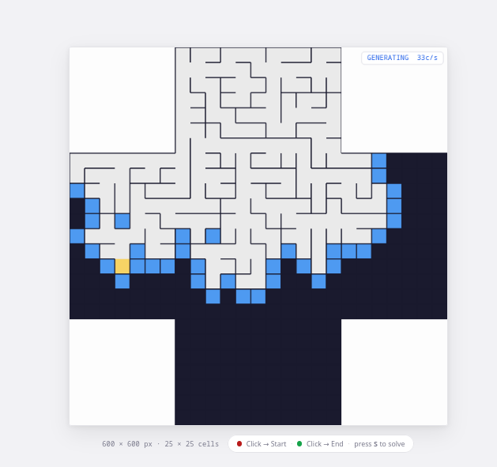
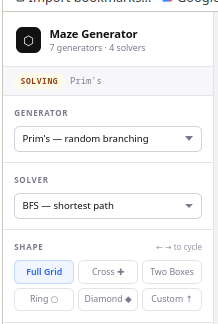
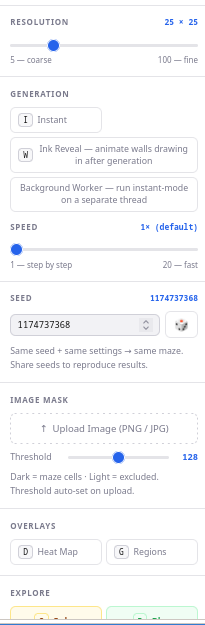

# Maze Generator & Solver

An interactive, browser-based maze generator and solver built with [p5.js](https://p5js.org/) and vanilla JavaScript ES Modules. Visualise seven different generation algorithms side-by-side with four solver strategies, explore mazes by hand with a player character, and export finished mazes as PNG or SVG.

---

## Preview

| | |
|:---:|:---:|
|  |  |
| **Completed maze** — Prim's algorithm, 25 × 25 | **BFS solver** — explored cells spreading from start |
|  |  |
| **Solution path** — green corridor traced to the end | **Shape masking** — Cross preset generating live |
|  |  |
| **Sidebar** — algorithm pickers and shape selector | **Sidebar** — seeded PRNG, generation options, image mask |

---

## Features

### 7 Generation Algorithms
| Algorithm | Character |
|---|---|
| **Prim's** | Random branching frontier — broad, bushy feel |
| **DFS (Recursive Backtracker)** | Long winding corridors, very few dead ends |
| **Aldous-Broder** | Completely unbiased random walk — every spanning tree equally likely (slow) |
| **Wilson's** | Loop-erased random walk — also unbiased, faster than Aldous-Broder; striking snaking paths |
| **Kruskal's** | Removes walls in random order via Union-Find — uniform, balanced texture |
| **Binary Tree** | One coin flip per cell (north or east) — extremely fast, strong diagonal bias |
| **Sidewinder** | Row-based runs — eliminates Binary Tree's diagonal bias, interesting horizontal corridors |

### 4 Solver Algorithms
| Solver | Character |
|---|---|
| **BFS** | Breadth-first search — guaranteed shortest path |
| **A\*** | Manhattan-distance heuristic — visibly aims toward the end |
| **Dead-end fill** | Floods dead ends until only the solution corridor remains — satisfying to watch |
| **Wall follower** | Right-hand rule — simulates a person keeping their right hand on the wall |

### Visual Overlays
- **Distance heat map** — BFS-based heatmap from the maze's diameter endpoint; every disconnected region gets its own gradient
- **Region colours** — each disconnected region painted a unique colour
- **Fog of war** — only cells the player has visited are revealed
- **Animation speed slider** — from one step per frame to 20× fast-forward
- **Live cells/s counter** — real-time generation throughput

### Shapes & Masking
- **Full Grid, Cross, Two Boxes, Ring, Diamond** — built-in preset shapes
- **Custom image mask** — upload any PNG/JPG; dark pixels become maze cells (Otsu's method sets the threshold automatically)
- **Threshold slider** — fine-tune image mask cutoff live

### Interactivity
- **Click to set Start / End** — two clicks on any in-maze cell
- **Arrow key player** — navigate the solved or unsolved maze manually
- **Fog of war** — toggle per-cell visibility for the player
- **Step counter & timer** — tracks how long and how many moves the player takes
- **Win overlay** — displayed when the player reaches the end cell

### Export
- **PNG** — saves the current canvas pixel-for-pixel
- **SVG** — clean vector output; walls are drawn once, scales to any size for printing or laser cutting

---

## Running Locally

The project uses native ES Modules (`type="module"`). Browsers block module imports over the `file://` protocol, so you must serve the files over HTTP.

**Python (simplest):**
```bash
cd project/
python3 -m http.server 8080
# then open http://localhost:8080
```

**Node / npx:**
```bash
npx serve project/
```

**VS Code:** use the [Live Server](https://marketplace.visualstudio.com/items?itemName=ritwickdey.LiveServer) extension and open `index.html`.

No build step, no bundler, no dependencies to install.

---

## Keyboard Shortcuts

| Key | Action |
|---|---|
| `R` | Restart (tap = animated, hold = rapid-cycle) |
| `S` | Toggle solve mode |
| `P` | Toggle play mode |
| `ESC` | Return to Generating mode |
| `← →` | Cycle preset shapes |
| `D` | Toggle distance heat map |
| `G` | Toggle region colours |
| `I` | Toggle instant mode |
| `F` | Toggle fog of war |
| `E` | Export PNG |
| `V` | Export SVG |
| `↑ ↓ ← →` | Move player (Play mode) |

**Mouse:** click any in-maze cell to set **Start** (red), click again to set **End** (green), then press `S` to animate the solution.

---

## Project Structure

```
project/
├── index.html                      ← UI: sidebar controls + canvas container
├── css/
│   └── style.css                   ← all styling (light minimal theme)
└── js/
    ├── sketch.js                   ← p5.js instance-mode entry point
    ├── core/
    │   ├── constants.js            ← CELL_STATES, DIRECTIONS (named exports)
    │   ├── Cell.js                 ← single grid cell (walls, state, region)
    │   ├── MazeGrid.js             ← 2D cell array, wall removal, passable-neighbor queries
    │   └── prng.js                 ← mulberry32 seeded PRNG + randomSeed helper
    ├── generators/
    │   ├── MazeGenerator.js        ← abstract base class (holds this.rng)
    │   ├── FrontierEntry.js        ← (in, out) pair used by Prim's
    │   ├── PrimsGenerator.js
    │   ├── DFSGenerator.js
    │   ├── AldousBroderGenerator.js
    │   ├── WilsonsGenerator.js
    │   ├── KruskalGenerator.js
    │   ├── BinaryTreeGenerator.js
    │   └── SidewinderGenerator.js
    ├── solvers/
    │   ├── MazeSolver.js           ← abstract base class
    │   ├── BFSSolver.js
    │   ├── AStarSolver.js
    │   ├── DeadEndFillSolver.js
    │   └── WallFollowerSolver.js
    ├── analysis/
    │   ├── BFSTraverser.js         ← strategy: BFS over open passages
    │   └── DistanceMap.js          ← computes + stores cell distances for heatmap
    ├── mask/
    │   └── MaskBuilder.js          ← preset shapes + image-to-mask conversion (Otsu's)
    └── worker/
        └── generatorWorker.js      ← Web Worker: runs generation off the main thread
```

---

## Architecture

The project follows the **Strategy Pattern** throughout.

### Generators

All generators extend `MazeGenerator` and implement two methods:

```js
init()              // reset grid state, seed the first cell
step(pickIndex)     // advance one unit of work
```

`pickIndex` is a function `(candidates[]) → index` that selects which candidate to use. The default is the module-level `randomPicker`, which draws from the current seeded PRNG (`mulberry32`). All seven generators honour `this.rng` — injecting a seeded instance makes every algorithm fully reproducible from a single integer.

`sketch.js` calls `maze.step(randomPicker)` once (or more, controlled by the speed slider) per `draw()` frame. The `frontier` array and `lastAddedCell` property on every generator give the renderer enough information to draw the active state without any coupling to algorithm internals.

### Solvers

All solvers extend `MazeSolver` and implement:

```js
init(startCell, endCell)   // reset search state
step()                     // advance one search step
```

Public properties used for rendering: `visitedSet`, `path`, `pathIndexMap`, `found`, `done`, `lastVisited`.

### Multi-region mazes

When a shape mask creates disconnected regions (e.g. Two Boxes), every generator handles this automatically: when the current region's frontier empties, `findFirstOutCell()` seeds the next region and increments `currentRegionIndex`. Each cell stores its `regionIndex`; the renderer and distance-map computation use this to apply region-specific colouring and gradients.

### Distance Map

`DistanceMap` accepts any object with a `traverse(grid, startCell) → Map<Cell, distance>` method. The default is `BFSTraverser`. To use a different traversal for the heatmap, pass a different strategy to the constructor — no other code changes.

---

## Extending the Project

### Adding a new generator

1. Create `js/generators/MyGenerator.js`:

```js
import MazeGenerator from './MazeGenerator.js';

export default class MyGenerator extends MazeGenerator {
  init()  { /* seed the grid */ }
  step()  { /* advance one step */ }
}
```

2. Add an `<option value="mykey">…</option>` to the `#algorithm` select in `index.html`.

3. Add one entry to `GENERATOR_MAP` in `js/sketch.js`:

```js
mykey: (grid) => new MyGenerator(grid),
```

Nothing else changes.

### Adding a new solver

1. Create `js/solvers/MySolver.js`:

```js
import MazeSolver from './MazeSolver.js';

export default class MySolver extends MazeSolver {
  constructor(grid) { super(grid); this.solverType = "mykey"; }
  init(startCell, endCell) { /* reset */ }
  step() { /* advance one step */ }
}
```

2. Add an `<option>` to the `#solver` select in `index.html`.

3. Add one entry to `SOLVER_MAP` in `js/sketch.js`:

```js
mykey: (grid) => new MySolver(grid),
```

### Adding a new shape

Add a static method to `js/mask/MaskBuilder.js`:

```js
static myShape(cols, rows) {
  return Array.from({ length: rows }, (_, row) =>
    Array.from({ length: cols }, (_, col) => /* true = included */)
  );
}
```

Then add an entry to the `PRESETS` array in `js/sketch.js` and a button in `index.html`.

---

## Technology

| | |
|---|---|
| **Rendering** | [p5.js](https://p5js.org/) v1 — instance mode |
| **Modules** | Native ES Modules (`import` / `export`) — no bundler |
| **Styling** | Plain CSS with custom properties |
| **PRNG** | mulberry32 — seeded, reproducible, statistically sound |
| **Concurrency** | Web Worker for off-thread instant-mode generation |
| **Image processing** | Otsu's method for automatic threshold selection |
| **Runtime** | Any modern browser; served over HTTP |

---

## License

MIT
